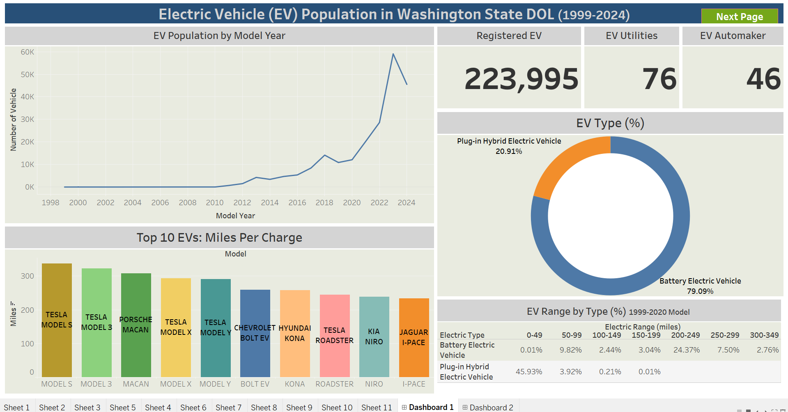
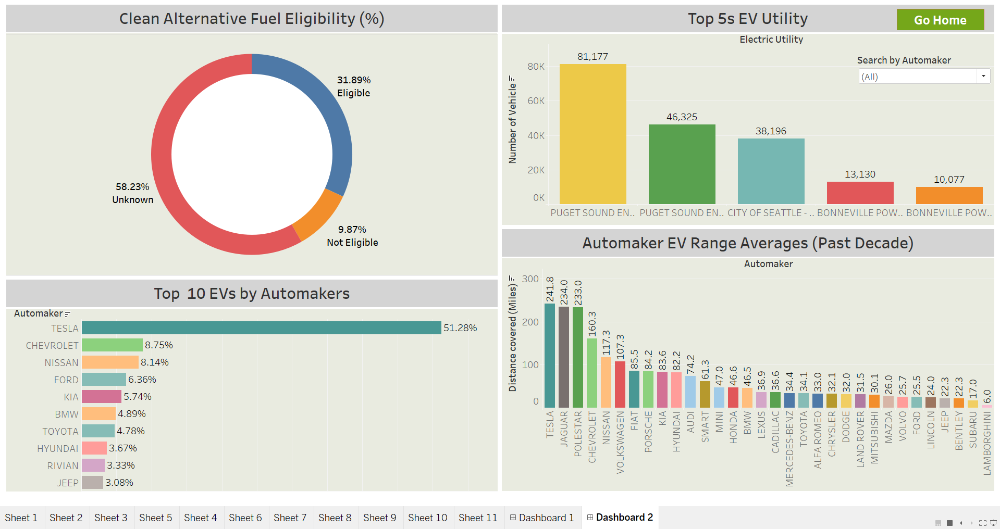

# Adaptation of the Electric Vehicle Population in Washington State

## Project Overview

This project focuses on analyzing the adaptation and growth of electric vehicles (EVs) in Washington State using data from the Washington State Department of Licensing from 1999 to 2024. The dataset, sourced from [Data.gov](https://catalog.data.gov/dataset/electric-vehicle-population-data), provides insights into the number of registered EVs, the types of vehicles, automakers, and the range per charge of popular EV models. The goal is to understand EV adoption trends and provide actionable insights for stakeholders, including policymakers, investors, and consumers.

## Problem Statement

The transportation sector significantly contributes to greenhouse gas emissions, and the transition to electric vehicles is essential for reducing the carbon footprint. However, EV adoption rates depend on several factors, including vehicle availability, infrastructure, range efficiency, and consumer incentives. This project aims to answer the following key questions:

-	What is the trend in EV adoption in Washington State from 1999 to 2024?
-	Which automakers and models dominate the EV market?
-	What is the distribution of battery-electric versus plug-in hybrid electric vehicles?
-	How do EV range capabilities impact adoption trends?
-	What role do utilities play in supporting EV infrastructure?

## Methodology

The following steps were taken to curate and visualize the data in Tableau:

### Data Collection

-	The dataset was retrieved from [Data.gov](https://catalog.data.gov/dataset/electric-vehicle-population-data), which contains detailed records of registered EVs in Washington State department of licensing.
-	The dataset includes vehicle make, model, year, range, type (Battery Electric Vehicle or Plug-in Hybrid Electric Vehicle), and registration counts.

### Data Cleaning and Preparation

-	Removed redundant and missing data entries to maintain data quality on Microsoft Excel.
-	Categorized vehicles based on automakers, model types, and range efficiency.
-	Standardized column names for better readability and visualization.

### Data Visualization and Analysis

**Dashboard 1: EV Population Overview**
-	EV Population Growth: A line chart was created to show the growth trend in EV registrations from 1999 to 2024 showing 223,995 registered EVs, and 76 EV utilities which involve 46 EV automakers.
-	EV Type Distribution: A pie chart was used to illustrate the proportion of Battery Electric Vehicles (BEVs) vs. Plug-in Hybrid Electric Vehicles (PHEVs).
-	Top EV Models by Range: A bar chart showcasing the top 10 EV models with the highest miles per charge.
-	EV Range Analysis: A table summarizing the percentage distribution of EVs by their electric range in miles.

**Dashboard 2: Eligibility and Automaker Insights**
-	Top EV Automakers: A stacked bar chart displaying market share by automaker.
-	EV Utility Support: A bar chart showing the contribution of the top 5 electric utilities supporting EV infrastructure.
-	Clean Alternative Fuel Eligibility: A donut chart indicating the percentage of EVs eligible for alternative fuel incentives.

**Interactive Dashboard**

_You can interact with the dashboard_ [here](https://public.tableau.com/app/profile/abiodun.afolabi6142/viz/ElectricVehiclePopulationinWashingtonStateDOL/Dashboard2)

## Key Insights and Findings

### Growth in EV Adoption

-	There has been an exponential increase in EV registrations, especially after 2018, indicating a strong push towards electrification.
-	The highest growth occurred between 2020 and 2023, suggesting policy incentives and improved EV infrastructure played a key role.

### Dominance of Battery Electric Vehicles (BEVs)

-	BEVs account for 79.09% of the total EV population, whereas PHEVs comprise 20.91%.
-	This trend suggests consumers prefer fully electric vehicles over hybrids due to advancements in battery technology and the availability of charging stations starting from 2020 to date.

### Automaker Market Share
-	Tesla dominates the EV market with 51.28% market share, followed by Chevrolet (8.75%), Nissan (8.14%), and Ford (6.36%) in the Top 10 EV Automakers.
-	Tesla's dominance is reinforced by its superior range and strong charging infrastructure.

### Impact of EV Range on Adoption

-	The majority of EVs have a range between 200-249 miles, accounting for 24.37% of the population.
-	Only a small percentage of EVs have ranges below 100 miles, indicating consumer preference for long-range vehicles.

### Role of Utility Companies

-	Puget Sound Energy supports the largest number of EVs (81,177), followed by Puget Sound Electric (46,325) and City of Seattle Electric (38,196).
-	Utility companies play a crucial role in expanding charging infrastructure to accommodate increasing EV adoption.

### Clean Alternative Fuel Eligibility

-	31.89% of EVs qualify for clean alternative fuel incentives, while 9.87% do not.
-	However, 58.23% of records have unknown eligibility, indicating a need for better data tracking and transparency.

## Recommendations for Stakeholders and Investors

### Policymakers & Government Agencies

-	Strengthen incentive programs to encourage EV adoption, especially for models with longer ranges.
-	Invest in expanding EV charging infrastructure to support increasing demand.
-	Improve data tracking on clean alternative fuel eligibility for better policy decisions.

### Automakers & Investors
-	Focus on producing long-range EVs (200+ miles) as they are the most preferred by consumers.
-	Tesla's market dominance suggests strong brand loyalty; other automakers should enhance battery efficiency and charging networks to compete.
-	Investors should consider funding EV infrastructure projects, especially in high-growth regions.

### Utility Companies
-	Expansion of public and residential EV charging stations is crucial to supporting EV growth.
-	Utilities should collaborate with state agencies to provide incentives for home and workplace charging installations.

## Conclusion

This Tableau project provides a comprehensive view of the electric vehicle population in Washington State, highlighting trends, market leaders, and adoption barriers. The insights generated can guide policymakers, automakers, investors, and utility companies in making informed decisions to accelerate EV adoption and infrastructure expansion. Continued monitoring and data analysis will be essential for supporting Washington State’s transition towards a sustainable transportation future.

**_End of Documentation_**
